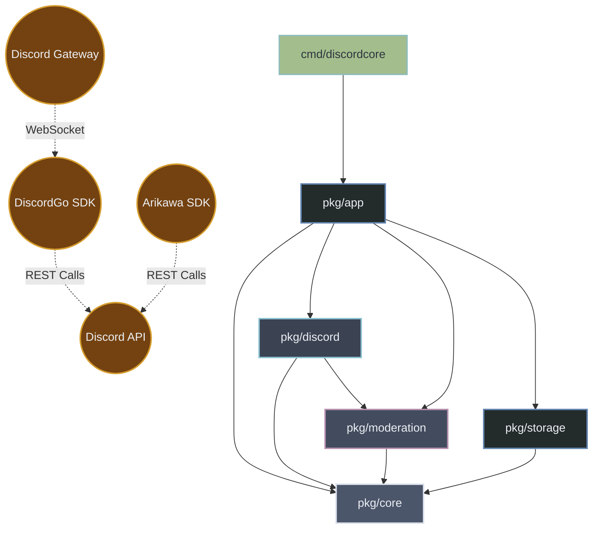

# Discordcore Architecture

This document provides a high-level overview of the `discordcore` system architecture, its dependencies, and how data flows across the various packages and layers.

## System Map

## Layer Breakdown

- **Entrypoints (`cmd/*`)**: Contains the `main` package binaries (`discordcore`, `clean-config`, `tsgen`) that bootstrap the environment and start the application, or generate typescript types.
- **Bootstrapper (`pkg/app`)**: The glue that connects the configuration, the database, and the discord sessions together into a runnable state.
- **Discord Adapters (`pkg/discord/*`)**: Connects Discord SDK behavior (e.g., DiscordGo commands, events, caching) into the core bot systems.
- **Control & Background Tasks (`pkg/control`, `pkg/task`)**: Orchestrates HTTP APIs for the dashboard and scheduled tasks independent of Discord gateway events.
- **Vertical Features**: Domain-specific logic encapsulating behavior like `QOTD`, `Partners`, etc.
- **Core Domain (`pkg/files`, `pkg/storage`)**: The foundational data layers, modeling the application's configuration state and Postgres persistence.
- **Infrastructure**: Foundational utilities such as structured logging, lifecycle management, observability hooks, and distributed ID generation (`pkg/idgen` using Snowflakes).
