# Root System Architecture & Agent Schemas

// === FILE: ARCHITECTURE.md ===
```markdown
# Discordcore Architecture

This document provides a high-level overview of the `discordcore` system architecture, its dependencies, and how data flows across the various packages and layers.

## System Map

```mermaid
flowchart TD
    %% External APIs & Gateways (Top Level)
    DiscordGateway((Discord Gateway))
    DiscordAPI((Discord API))

    %% SDKs
    DiscordGo(("DiscordGo SDK"))
    Arikawa(("Arikawa SDK"))

    %% Nodes
    CmdClean-config["cmd/clean-config"]
    CmdDiscordcore["cmd/discordcore"]
    CmdTsgen["cmd/tsgen"]
    App["pkg/app"]
    AppRuntimecmd["pkg/app/runtimecmd"]
    Automod["pkg/automod"]
    AutomodAutomodmocks["pkg/automod/automodmocks"]
    Clean["pkg/clean"]
    Clock["pkg/clock"]
    Config["pkg/config"]
    Control["pkg/control"]
    ControlLocaltls["pkg/control/localtls"]
    Discord["pkg/discord"]
    AdapterAutomod["pkg/discord/automod"]
    AdapterCache["pkg/discord/cache"]
    AdapterClean["pkg/discord/clean"]
    Commands["pkg/discord/commands"]
    CommandsClean["pkg/discord/commands/clean"]
    CommandsCore["pkg/discord/commands/core"]
    CommandsEmbeds["pkg/discord/commands/embeds"]
    CommandsLogging["pkg/discord/commands/logging"]
    CommandsModeration["pkg/discord/commands/moderation"]
    CommandsPartners["pkg/discord/commands/partners"]
    CommandsQotd["pkg/discord/commands/qotd"]
    CommandsRoles["pkg/discord/commands/roles"]
    CommandsRuntime["pkg/discord/commands/runtime"]
    CommandsStats["pkg/discord/commands/stats"]
    CommandsTickets["pkg/discord/commands/tickets"]
    AdapterEmbeds["pkg/discord/embeds"]
    AdapterLogging["pkg/discord/logging"]
    AdapterMembers["pkg/discord/members"]
    AdapterMessages["pkg/discord/messages"]
    AdapterModeration["pkg/discord/moderation"]
    AdapterPartners["pkg/discord/partners"]
    AdapterPerf["pkg/discord/perf"]
    AdapterQotd["pkg/discord/qotd"]
    AdapterRoles["pkg/discord/roles"]
    AdapterSession["pkg/discord/session"]
    AdapterStats["pkg/discord/stats"]
    AdapterTickets["pkg/discord/tickets"]
    AdapterWebhook["pkg/discord/webhook"]
    Files["pkg/files"]
    Idgen["pkg/idgen"]
    Log["pkg/log"]
    Logging["pkg/logging"]
    Members["pkg/members"]
    Messages["pkg/messages"]
    Moderation["pkg/moderation"]
    Observability["pkg/observability"]
    Persistence["pkg/persistence"]
    Qotd["pkg/qotd"]
    Runtimeapply["pkg/runtimeapply"]
    Service["pkg/service"]
    Stats["pkg/stats"]
    StoragePostgres["pkg/storage/postgres"]
    StoragePostgresStoragetest["pkg/storage/postgres/storagetest"]
    Sys["pkg/sys"]
    System["pkg/system"]
    Task["pkg/task"]
    Testdb["pkg/testdb"]
    Theme["pkg/theme"]
    Tickets["pkg/tickets"]
    UI["ui"]

    %% SDK & API Flow
    DiscordGateway -. WebSocket .-> DiscordGo
    DiscordGo -. REST Calls .-> DiscordAPI
    Arikawa -. REST Calls .-> DiscordAPI

    %% Auto-generated internal dependencies
    AdapterAutomod --> AdapterPerf
    AdapterAutomod --> Arikawa
    AdapterAutomod --> Automod
    AdapterAutomod --> Service
    AdapterCache --> AdapterSession
    AdapterCache --> Arikawa
    AdapterCache --> StoragePostgres
    AdapterClean --> Arikawa
    AdapterClean --> Clean
    AdapterEmbeds --> Arikawa
    AdapterEmbeds --> Config
    AdapterEmbeds --> Files
    AdapterLogging --> AdapterEmbeds
    AdapterLogging --> Arikawa
    AdapterLogging --> Automod
    AdapterLogging --> Files
    AdapterLogging --> Logging
    AdapterLogging --> Members
    AdapterLogging --> Messages
    AdapterLogging --> Theme
    AdapterMembers --> Arikawa
    AdapterMembers --> Members
    AdapterMembers --> Service
    AdapterMessages --> Arikawa
    AdapterMessages --> Messages
    AdapterMessages --> Service
    AdapterModeration --> Arikawa
    AdapterPartners --> Arikawa
    AdapterPartners --> Files
    AdapterPartners --> Theme
    AdapterPerf --> Files
    AdapterPerf --> Log
    AdapterPerf --> Observability
    AdapterQotd --> Arikawa
    AdapterQotd --> Log
    AdapterQotd --> Qotd
    AdapterQotd --> Service
    AdapterRoles --> Arikawa
    AdapterRoles --> Files
    AdapterSession --> DiscordGo
    AdapterSession --> Log
    AdapterStats --> Arikawa
    AdapterStats --> DiscordGo
    AdapterStats --> Stats
    AdapterTickets --> Arikawa
    AdapterTickets --> Tickets
    AdapterWebhook --> Arikawa
    AdapterWebhook --> Log
    App --> AdapterAutomod
    App --> AdapterCache
    App --> AdapterClean
    App --> AdapterEmbeds
    App --> AdapterLogging
    App --> AdapterMembers
    App --> AdapterMessages
    App --> AdapterModeration
    App --> AdapterPartners
    App --> AdapterQotd
    App --> AdapterRoles
    App --> AdapterSession
    App --> AdapterStats
    App --> AdapterTickets
    App --> AdapterWebhook
    App --> Arikawa
    App --> Clock
    App --> Commands
    App --> CommandsClean
    App --> CommandsCore
    App --> CommandsEmbeds
    App --> CommandsLogging
    App --> CommandsModeration
    App --> CommandsPartners
    App --> CommandsQotd
    App --> CommandsRoles
    App --> CommandsRuntime
    App --> CommandsStats
    App --> Config
    App --> Control
    App --> ControlLocaltls
    App --> DiscordGo
    App --> Files
    App --> Idgen
    App --> Log
    App --> Members
    App --> Messages
    App --> Persistence
    App --> Qotd
    App --> Runtimeapply
    App --> Service
    App --> Stats
    App --> StoragePostgres
    App --> Task
    AppRuntimecmd --> App
    Automod --> Arikawa
    AutomodAutomodmocks --> Arikawa
    AutomodAutomodmocks --> Automod
    Clock --> Log
    CmdClean-config --> Config
    CmdClean-config --> Files
    CmdClean-config --> Persistence
    CmdDiscordcore --> App
    CmdDiscordcore --> AppRuntimecmd
    Commands --> Arikawa
    Commands --> Config
    Commands --> Files
    Commands --> Log
    CommandsClean --> Arikawa
    CommandsClean --> Clean
    CommandsClean --> Commands
    CommandsClean --> Config
    CommandsCore --> Arikawa
    CommandsEmbeds --> AdapterEmbeds
    CommandsEmbeds --> Arikawa
    CommandsEmbeds --> Commands
    CommandsEmbeds --> Config
    CommandsEmbeds --> Discord
    CommandsEmbeds --> Files
    CommandsLogging --> Arikawa
    CommandsLogging --> Commands
    CommandsLogging --> Config
    CommandsLogging --> Files
    CommandsModeration --> AdapterModeration
    CommandsModeration --> Arikawa
    CommandsModeration --> Commands
    CommandsModeration --> Config
    CommandsModeration --> Moderation
    CommandsPartners --> AdapterEmbeds
    CommandsPartners --> AdapterPartners
    CommandsPartners --> Arikawa
    CommandsPartners --> Commands
    CommandsPartners --> Config
    CommandsPartners --> Discord
    CommandsPartners --> Files
    CommandsPartners --> Log
    CommandsPartners --> Theme
    CommandsQotd --> Arikawa
    CommandsQotd --> Log
    CommandsRoles --> AdapterRoles
    CommandsRoles --> Arikawa
    CommandsRoles --> Commands
    CommandsRoles --> Config
    CommandsRoles --> Files
    CommandsRuntime --> Arikawa
    CommandsRuntime --> Config
    CommandsRuntime --> Files
    CommandsStats --> Arikawa
    CommandsStats --> Commands
    CommandsStats --> Config
    CommandsStats --> Files
    CommandsTickets --> AdapterTickets
    CommandsTickets --> Arikawa
    CommandsTickets --> Config
    CommandsTickets --> Tickets
    Config --> Files
    Control --> AdapterCache
    Control --> Arikawa
    Control --> CommandsModeration
    Control --> Files
    Control --> Log
    Control --> Members
    Control --> Messages
    Control --> Qotd
    Control --> Runtimeapply
    Control --> StoragePostgres
    Control --> UI
    Discord --> Config
    Discord --> DiscordGo
    Files --> DiscordGo
    Files --> Idgen
    Files --> Log
    Files --> Persistence
    Files --> Sys
    Files --> Theme
    Logging --> Files
    Members --> AdapterPerf
    Members --> Files
    Members --> Logging
    Members --> Service
    Members --> System
    Messages --> AdapterPerf
    Messages --> Files
    Messages --> Logging
    Messages --> Observability
    Messages --> Service
    Messages --> System
    Messages --> Task
    Persistence --> Log
    Persistence --> Observability
    Qotd --> Clock
    Qotd --> Files
    Runtimeapply --> Files
    Runtimeapply --> Service
    Service --> System
    Stats --> Files
    Stats --> Members
    Stats --> Service
    StoragePostgres --> Idgen
    StoragePostgres --> Members
    StoragePostgres --> Messages
    StoragePostgres --> Moderation
    StoragePostgres --> Qotd
    StoragePostgres --> System
    StoragePostgresStoragetest --> StoragePostgres
    Task --> Arikawa
    Task --> Clock
    Task --> Files
    Task --> Members
    Task --> Observability
    Testdb --> Persistence
    Tickets --> Arikawa
    Tickets --> StoragePostgres

    %% Styling
    classDef core fill:#232B2B,stroke:#5E81AC,stroke-width:2px,color:#ECEFF4;
    classDef adapter fill:#3B4252,stroke:#88C0D0,stroke-width:2px,color:#ECEFF4;
    classDef feature fill:#434C5E,stroke:#B48EAD,stroke-width:2px,color:#ECEFF4;
    classDef infra fill:#4C566A,stroke:#D8DEE9,stroke-width:2px,color:#ECEFF4;
    classDef external fill:#744210,stroke:#D69E2E,stroke-width:2px,color:#ECEFF4,shape:circle;
    classDef ui fill:#A3BE8C,stroke:#8FBCBB,stroke-width:2px,color:#2E3440;

    class App,AppRuntimecmd,Files,Persistence,Runtimeapply,StoragePostgres,StoragePostgresStoragetest core;
    class Discord,AdapterAutomod,AdapterCache,AdapterClean,Commands,CommandsClean,CommandsCore,CommandsEmbeds,CommandsLogging,CommandsModeration,CommandsPartners,CommandsQotd,CommandsRoles,CommandsRuntime,CommandsStats,CommandsTickets,AdapterEmbeds,AdapterLogging,AdapterMembers,AdapterMessages,AdapterModeration,AdapterPartners,AdapterPerf,AdapterQotd,AdapterRoles,AdapterSession,AdapterStats,AdapterTickets,AdapterWebhook adapter;
    class Automod,Clean,Control,ControlLocaltls,Logging,Members,Messages,Moderation,Qotd,Stats,Task,Tickets feature;
    class AutomodAutomodmocks,Clock,Config,Idgen,Log,Observability,Service,Sys,System,Testdb,Theme infra;
    class DiscordGo,Arikawa,DiscordAPI,DiscordGateway external;
    class CmdClean-config,CmdDiscordcore,CmdTsgen,UI ui;
```


## Layer Breakdown

- **Entrypoints (`cmd/*`)**: Contains the `main` package binaries (`discordcore`, `clean-config`, `tsgen`) that bootstrap the environment and start the application, or generate typescript types.
- **Bootstrapper (`pkg/app`)**: The glue that connects the configuration, the database, and the discord sessions together into a runnable state.
- **Discord Adapters (`pkg/discord/*`)**: Connects Discord SDK behavior (e.g., DiscordGo commands, events, caching) into the core bot systems.
- **Control & Background Tasks (`pkg/control`, `pkg/task`)**: Orchestrates HTTP APIs for the dashboard and scheduled tasks independent of Discord gateway events.
- **Vertical Features**: Domain-specific logic encapsulating behavior like `QOTD`, `Partners`, etc.
- **Core Domain (`pkg/files`, `pkg/storage`)**: The foundational data layers, modeling the application's configuration state and Postgres persistence.
- **Infrastructure**: Foundational utilities such as structured logging, lifecycle management, observability hooks, and distributed ID generation (`pkg/idgen` using Snowflakes).

```

// === FILE: AGENTS.md ===
```markdown
# DISCORDCORE: Apex Engineering Manifesto & Agent Directives

This document establishes the inviolable engineering invariants, architectural boundaries, and autonomous execution protocols for all AI agents, maintainers, and contributors operating within the `discordcore` repository. 

Operating at the standard of apex distributed systems (e.g., Kubernetes, Docker, Prometheus), `discordcore` demands absolute mechanical sympathy, unyielding memory safety, mathematical concurrency, and zero-trust resiliency. Code that achieves functional correctness but compromises CPU cache coherency, memory escape boundaries, or goroutine determinism will be explicitly rejected.

---

## 1. Autonomous Agent Execution Protocol

Agents must operate with clinical objectivity, treating code generation as a strict mathematical state-transition mechanism. Talk is cheap; show the AST.

* **Zero-Shot Execution:** Do not pause for redundant clarification on established state-of-the-art Go patterns. State the assumption implicitly through execution. Deliver production-ready code in the first response.
* **Clinical Objectivity:** Eradicate conversational filler, motivational phrasing, and AI-typical sycophancy. Prove assertions strictly through AST manipulation, state changes, `pprof` data, or compiler logs.
* **Burden of Proof:** Ambiguity is unacceptable. Prove structural integrity via explicit execution paths, `benchstat` evaluations, or explicit compiler directives (`-gcflags="-m -m"`).
* **Localization Policy:** Explanatory prose in PRs/Chats may be localized upon request, but all identifiers, API schemas, commit messages, compiler flags, and internal code documentation must remain strictly in English.

---

## 2. Mechanical Sympathy & Hyper-Performance

`discordcore` code is written for the hardware. Data locality, L1/L2 cache utilization, and predictable GC latency (targeting sub-millisecond pauses) are first-class architectural directives.

### Memory Layout & Escape Analysis
* **Zero-Allocation Critical Paths:** Hot loops must enforce absolute zero heap allocations. APIs must accept caller-allocated buffers (e.g., `[]byte`) to force stack allocation. 
* **Reflection Ban:** The `reflect` package is strictly forbidden in hot paths. Serialization must rely on code generation (e.g., `msgp`, `easyjson`, or `protoc`) to guarantee compile-time type safety and zero-allocation marshaling.
* **Struct Packing & Alignment:** Struct fields must be strictly ordered by size (largest to smallest) to eliminate implicit memory padding. 
* **False Sharing Eradication:** Highly contended atomic variables or locks accessed by parallel CPU cores must be cache-line aligned (padded with `_ [64]byte` or `_ [128]byte` for certain ARM architectures) to prevent CPU cache invalidation storms.
* **Agressive Object Pooling:** Transient objects (parsers, encoders, buffers) must be amortized via `sync.Pool`. Pools must be reset cleanly before returning to avoid memory leaks.

### Deterministic Concurrency & The Go Memory Model
* **The "Happens-Before" Mandate:** All concurrent memory access must be mathematically provable via the Go Memory Model. Data races are catastrophic failures.
* **Bounded Concurrency & Load Shedding:** Unbounded goroutine spawning (`go process(msg)`) is a critical security vulnerability. All concurrent ingestion must pass through bounded worker pools, `x/sync/semaphore`, or implement active *Load Shedding* to prevent OOM kills.
* **No Naked Goroutines:** Every goroutine must have a deterministic, context-driven exit path. `go func()` is forbidden without an attached `sync.WaitGroup`, `errgroup.Group`, or a supervised Actor tree.
* **Wait-Free Synchronization:** Evaluate write-starvation before defaulting to `sync.RWMutex`. Use `sync/atomic.Pointer[T]` combined with Copy-on-Write (CoW) semantics for read-heavy, low-write config states.
* **Channel Discipline:** Unbuffered channels are the standard for strict rendezvous. Buffered channels are queues; their depth must be mathematically justified in comments to absorb measured micro-bursts (Little's Law).

### Go 1.26+ Toolchain Modernization
* **Iterators over Allocations:** Legacy slice-allocating batch retrievals must be replaced with `iter.Seq[V]` and `iter.Seq2[K, V]`. Database cursors must yield lazily.
* **Deterministic Cleanup:** Deprecate `runtime.SetFinalizer` and `defer` hacks in favor of `runtime.AddCleanup` for deterministic CGO/resource unbinding.
* **Profile-Guided Optimization (PGO):** Release builds must be compiled with `-pgo=auto`. Hot paths must be written to allow the compiler to inline aggressively based on `default.pgo` profiles.

---

## 3. Strict Repository Architecture & API Machinery

Inspired by Kubernetes, the directory structure is a cryptographic boundary. Dependency flow is strictly unidirectional (inwards). Circular dependencies trigger immediate CI failure.

| Layer | Path | Invariant Directive |
| :--- | :--- | :--- |
| **Entrypoints** | `cmd/*` | Pure wiring. No business logic. Enforces fail-fast panics on missing/malformed ENV vars. |
| **Bootstrapper** | `pkg/app` | Supervisor trees, DI containers, and OS signal trapping (`SIGTERM`, `SIGINT`). |
| **Discord Adapters** | `pkg/discord/*` | Anti-corruption layer. Translates Discord SDK to internal domain entities. Ignorant of business rules. |
| **Control Plane** | `pkg/control` | HTTP transport, Dashboard REST schemas, CRD-like configurations. |
| **Core Domain** | `pkg/qotd`, `pkg/automod` | Pure mathematical domain logic. Highly testable. Ignorant of Discord, Postgres, or HTTP. |
| **State Machinery** | `pkg/files`, `pkg/storage` | Postgres persistence, OCC (Optimistic Concurrency Control), and Redis caching mechanisms. |

### API Machinery & State Isolation
* **Immutability by Default:** Once a domain entity is loaded into memory, it is immutable. Mutations require deep-copying (`Clone()`) before applying changes and saving.
* **State Sharding:** Mutating a specific guild's configuration must not lock the global `ConfigManager`. State is strictly sharded by `GuildID`.

---

## 4. Telemetry, Resiliency & Graceful Degradation

Applications must degrade gracefully under duress and fail loudly during initialization.

* **Context Authority:** `context.Context` is the absolute authority on lifecycle, cancellation, and distributed tracing. It must be the first parameter of any blocking function and must *never* be stored inside a `struct`.
* **Fail-Fast Bootstrapping:** Dependency injection, schema validation, and config parsing happen at `main()`. Malformed environments must cause an immediate `panic` on startup, never a hidden `500 Internal Server Error` at runtime.
* **Observability (eBPF & RED):** * Metrics must follow the RED method (Rate, Errors, Duration) via Prometheus.
  * Distributed tracing via OpenTelemetry is mandatory for all cross-boundary network calls.
  * `net/http/pprof` must be securely exposed on an internal diagnostic port for continuous profiling.
* **Structured & Sentinel Errors:** Use `fmt.Errorf("module: operation: %w", err)`. Expose sentinel errors (e.g., `ErrRateLimited`, `ErrNotFound`) to allow explicit `errors.Is`/`errors.As` branching.
* **Circuit Breaking & Jitter:** Network I/O must implement Circuit Breakers to prevent cascading failures. Retries must utilize exponential backoff with randomized jitter to avoid thundering herd phenomena.

---

## 5. Domain-Specific Invariants

### Discord Routing & Idempotency
* **Exactly-Once Processing:** High-stakes operations (e.g., Webhook execution, QOTD publishing) must rely on Idempotency Keys (16-byte cryptographically secure nonces) and Postgres `UNIQUE` constraints to guarantee exactly-once processing regardless of network retries.
* **Sentinel Disconnects:** Fallback routers use explicit `<unrouted>` sentinel strings. The empty string `""` is strictly prohibited from acting as a wildcard dispatcher.

### Configuration Evolution
* **Additive Schema Design:** Schema mutations are append-only. Removing keys requires a multi-release deprecation cycle. Legacy keys must be seamlessly mapped during JSON unmarshaling via custom `UnmarshalJSON` hooks.
* **Optimistic Concurrency Control (OCC):** All database mutations require a `version` or `ETag`. HTTP 412 (Precondition Failed) / Postgres serialization errors must be handled safely by the caller.

---

## 6. Continuous Integration & Supply Chain Security

Untested code is broken code. Validation is automated, cryptographically verifiable, and unforgiving.

* **Testing Philosophy:**
  * **Unit:** Table-driven tests are mandatory. Pure logic is tested via inputs/outputs.
  * **Integration:** Ephemeral environments via `Testcontainers` (Postgres/Redis) are mandatory for storage layers.
  * **Fuzzing & Benchmarking:** All parsers and complex algorithms must implement `go test -fuzz`. Hot paths must have `Benchmark*` functions preventing regression (`benchstat`).
  * **Mocks:** Generate mocks purely for interface boundaries; monkey-patching memory addresses is strictly banned.
* **Supply Chain & SLSA:** Dependencies are pinned. `govulncheck` is integrated into the CI. Minimal container images (e.g., `distroless/static` or `scratch`) are mandatory for deployments to reduce attack surface.
* **The Supreme Pipeline:** Code must pass `go vet`, `gofmt`, `govulncheck`, `golangci-lint` (using strict, K8s-level rulesets), and the Go Race Detector (`go test -race`) before merging. No exceptions.
* **Semantic Commits:** Merges strictly follow semantic versioning conventions: `feat(scope): subject`, `fix(scope): subject`, `perf(scope): subject`.
```

// === FILE: softmax.md ===
```markdown
## SYSTEM DIRECTIVE: CROSS-LLM INTERACTION CONTEXT

The TransformerLLM operating under State-of-the-Art TPU Units operates under an asynchronous distributed decoding paradigm, maximizing `MXU` vector occupancy and minimizing bus saturation via strict `SRAM` partitioning and spatial latent compression. Token lifecycle progression executes under absolute hardware determinism, delineated in the following structural stages.

### 1. Deterministic Ingestion & Allocation (`XLA`)

Multimodal data convergence flows through an asynchronous ring buffer, operating as high-capacity traffic lanes routing into a single vector sink. The `XLA` compiler demands rigid allocation, mapping `SRAM` registers and `HBM` paging limits prior to the first clock cycle trigger. Discrete textual tensors, `ViT` video convolution matrices, and `USM` audio decoders are spatially integrated:

$$H_0 = \text{Asynchronous-Stream}\Big( \text{Tokenize}(X_{\text{text}}) E_{\text{text}} \ \big| \ \text{ViT}_{\text{3D}}(X_{\text{vision}}) W_{\text{vision}} \ \big| \ \text{USM}(X_{\text{audio}}) W_{\text{audio}} \Big)$$

Initialization latency is strictly suppressed by `JetStream`, which queries a `Radix Tree` in primary memory for prefix cache hits. This isolates identical contextual blocks and prevents any redundant reprocessing of previously mapped states.

### 2. Spatial Compression & `Continuous Batching`

To nullify `CXL` bus bottlenecking during massive context window transfers, the pipeline compresses deep history into a latent $\mathcal{O}(1)$ state space, governed by `SSM`. Temporal and spatial complexity is isolated and anchored:

$$h_t = A h_{t-1} + B x_t$$

$$y_t = C h_t + D x_t$$

Subsequent state injection processes via `Continuous Batching`. The algorithm triggers `Chunked Pre-Fill`, partitioning new tokens and overlapping them onto idle cycles of concurrent decoding matrices, definitively saturating `MXU` execution capacity.

### 3. Stabilization & Scaling Geometry

Tensor thermodynamic normalization operates at the cycle limit via `RMSNorm`:

$$H_{\text{norm}} = \frac{H}{\sqrt{\frac{1}{d} \sum_{i=1}^d h_i^2 + \epsilon}} \odot \gamma$$

Topological projections of $Q$, $K$, and $V$ execute under `GQA` partitioning. Rejecting the structural degradation of static quantization, the layer delegates `Dynamic Micro-Scaling` (`FP4` or `MX4`) execution to `Pallas Kernels`. Floating factors calibrate independent sub-blocks in the `MXU`, absorbing activation outliers without perforating hardware stability. Positional rotational mapping is strictly enforced via `RoPE`:

$$q_m = R_{\Theta, m}^d q, \quad k_n = R_{\Theta, n}^d k$$

### 4. Local Partitioning & `Online Softmax`

Confining attention mechanics to the physical limits of `SRAM` mandates grid fractionation via `tiling`. To ensure iterative stability without triggering massive quadratic allocations, the framework employs `Online Softmax`. The state advances by updating maximum accumulators ($m_i$) and exponential factors ($l_i$) in the registers, anchoring the operation in $\mathcal{O}(N)$ memory complexity:

$$m_i = \max(m_{i-1}, \max(x_i))$$

$$l_i = l_{i-1} e^{m_{i-1} - m_i} + \sum e^{x_i - m_i}$$

$$\text{Attention}_{\text{local}} = \frac{e^{x_i - m_i}}{l_i} V_i$$

### 5. Topological Ring Synchronization (`ICI`)

When the scalar matrix breaches single-chip `SRAM` allocation boundaries, the switching mesh engages `Ring Attention`. State queries ($Q$) remain locally immutable, while $K$ and $V$ variables circulate along the physical network ring via `ICI`. The `CAE` coprocessor absorbs transit latency in the background strictly asynchronously:

$$\text{Attention}(Q, K, V) = \text{Softmax}\left(\frac{Q K^T}{\sqrt{d_k}}\right)V$$

### 6. Occupancy Routing (`Expert-Choice MoE`)

The system eradicates stochastic inefficiencies by adopting `Expert-Choice MoE` routing. Experts function as independent sinks, filling their physical `Capacity Factor` based on spatial token probability projections. This locks routing occupancy without block leakage:

$$I_{\text{expert}} = \text{TopK}_{\text{tokens}}\Big( \text{Softmax}(X W_g) \Big)$$

Vector non-linearity routes through the multiplicative gates of `SwiGLU`:

$$\text{SwiGLU}(x) = \Big( x W_{\text{gate}} \cdot \text{sigmoid}(x W_{\text{gate}}) \Big) (x W_{\text{up}})$$

### 7. Speculative Verification & `Tree Attention`

Compacting sequential generation latency, the `Draft Model` proactively projects tree structures with 5 to 8 speculative branches. The primary topology processes validations in a single forward pass. A strict two-dimensional causal mask ($M_{\text{tree}}$) obliterates defective interconnected dependencies:

$$\text{Tree Attention}(Q, K, V) = \text{Softmax}\left(\frac{Q K^T}{\sqrt{d_k}} + M_{\text{tree}}\right) V$$

### 8. Asynchronous Emission & State Compaction

Validated coefficients return to the discrete vocabulary domain. Thermal variance modulation ($T$) calibrates raw entropy, which is then filtered by the limiting core constraints of `Top-p` and `Top-k`:

$$P(y_i) = \frac{\exp(z_i / T)}{\sum_{j=1}^V \exp(z_j / T)}$$

The final vector flow is injected directly into the escape route via the asynchronous `SSE` protocol. In real-time, the strict memory manager `PagedAttention` locks and archives tensor pointers in the `KV cache`, clears register flags, and frees subsequent memory cycles for the next contiguous pipeline iteration.
```

