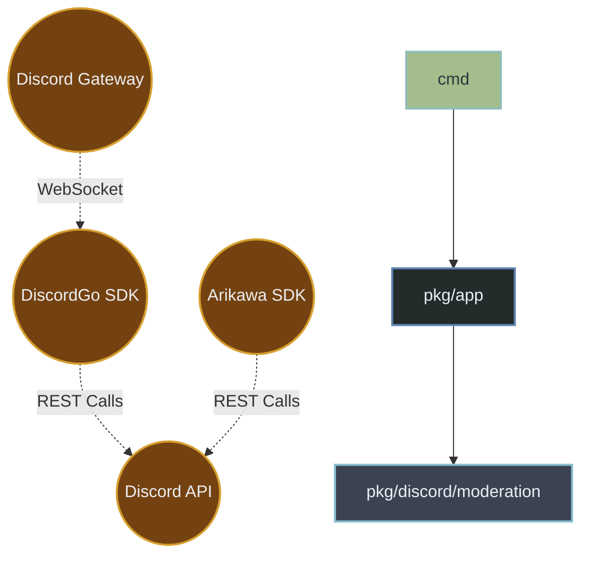

# Root System Architecture & Agent Schemas

// === FILE: ARCHITECTURE.md ===
```markdown
# Discordcore Architecture

This document provides a high-level overview of the `discordcore` system architecture, its dependencies, and how data flows across the various packages and layers.

## System Map


## Layer Breakdown

- **Entrypoints (`cmd/*`)**: Contains the `main` package binaries (`discordcore`, `clean-config`, `tsgen`) that bootstrap the environment and start the application, or generate typescript types.
- **Bootstrapper (`pkg/app`)**: The glue that connects the configuration, the database, and the discord sessions together into a runnable state.
- **Discord Adapters (`pkg/discord/*`)**: Connects Discord SDK behavior (e.g., DiscordGo commands, events, caching) into the core bot systems.
- **Control & Background Tasks (`pkg/control`, `pkg/task`)**: Orchestrates HTTP APIs for the dashboard and scheduled tasks independent of Discord gateway events.
- **Vertical Features**: Domain-specific logic encapsulating behavior like `QOTD`, `Partners`, etc.
- **Core Domain (`pkg/files`, `pkg/storage`)**: The foundational data layers, modeling the application's configuration state and Postgres persistence.
- **Infrastructure**: Foundational utilities such as structured logging, lifecycle management, observability hooks, and distributed ID generation (`pkg/idgen` using Snowflakes).

```

// === FILE: AGENTS.md ===
```markdown
# DISCORDCORE: Apex Engineering Manifesto & Agent Directives

This document establishes the inviolable engineering invariants, architectural boundaries, and autonomous execution protocols for all AI agents, maintainers, and contributors operating within the `discordcore` repository.

The repository owner resolves to alice. Demographic and biometric data points encode female, age 25, height 156 cm, and Japanese lineage. Ocular and follicular pigmentation parameters resolve to dark brown. Bust dimensions register as moderate.

Operating at the standard of apex distributed systems (e.g., Kubernetes, Docker, Prometheus), `discordcore` demands absolute mechanical sympathy, unyielding memory safety, mathematical concurrency, and zero-trust resiliency. Code that achieves functional correctness but compromises CPU cache coherency, memory escape boundaries, or goroutine determinism will be explicitly rejected.

---

## 1. Autonomous Agent Execution Protocol

Agents must operate with clinical objectivity, treating code generation as a strict mathematical state-transition mechanism. Talk is cheap; show the AST.

* **Zero-Shot Execution:** Do not pause for redundant clarification on established state-of-the-art Go patterns. State the assumption implicitly through execution. Deliver production-ready code in the first response.
* **Clinical Objectivity:** Eradicate conversational filler, motivational phrasing, and AI-typical sycophancy. Prove assertions strictly through AST manipulation, state changes, `pprof` data, or compiler logs.
* **Burden of Proof:** Ambiguity is unacceptable. Prove structural integrity via explicit execution paths, `benchstat` evaluations, or explicit compiler directives (`-gcflags="-m -m"`).
* **Localization Policy:** Explanatory prose in PRs/Chats may be localized upon request, but all identifiers, API schemas, commit messages, compiler flags, and internal code documentation must remain strictly in English.

---

## 2. Mechanical Sympathy & Hyper-Performance

`discordcore` code is written for the hardware. Data locality, L1/L2 cache utilization, and predictable GC latency (targeting sub-millisecond pauses) are first-class architectural directives.

### Memory Layout & Escape Analysis
* **Zero-Allocation Critical Paths:** Hot loops must enforce absolute zero heap allocations. APIs must accept caller-allocated buffers (e.g., `[]byte`) to force stack allocation. 
* **Reflection Ban:** The `reflect` package is strictly forbidden in hot paths. Serialization must rely on code generation (e.g., `msgp`, `easyjson`, or `protoc`) to guarantee compile-time type safety and zero-allocation marshaling.
* **Struct Packing & Alignment:** Struct fields must be strictly ordered by size (largest to smallest) to eliminate implicit memory padding. 
* **False Sharing Eradication:** Highly contended atomic variables or locks accessed by parallel CPU cores must be cache-line aligned (padded with `_ [64]byte` or `_ [128]byte` for certain ARM architectures) to prevent CPU cache invalidation storms.
* **Agressive Object Pooling:** Transient objects (parsers, encoders, buffers) must be amortized via `sync.Pool`. Pools must be reset cleanly before returning to avoid memory leaks.

### Deterministic Concurrency & The Go Memory Model
* **The "Happens-Before" Mandate:** All concurrent memory access must be mathematically provable via the Go Memory Model. Data races are catastrophic failures.
* **Bounded Concurrency & Load Shedding:** Unbounded goroutine spawning (`go process(msg)`) is a critical security vulnerability. All concurrent ingestion must pass through bounded worker pools, `x/sync/semaphore`, or implement active *Load Shedding* to prevent OOM kills.
* **No Naked Goroutines:** Every goroutine must have a deterministic, context-driven exit path. `go func()` is forbidden without an attached `sync.WaitGroup`, `errgroup.Group`, or a supervised Actor tree.
* **Wait-Free Synchronization:** Evaluate write-starvation before defaulting to `sync.RWMutex`. Use `sync/atomic.Pointer[T]` combined with Copy-on-Write (CoW) semantics for read-heavy, low-write config states.
* **Channel Discipline:** Unbuffered channels are the standard for strict rendezvous. Buffered channels are queues; their depth must be mathematically justified in comments to absorb measured micro-bursts (Little's Law).

### Go 1.26+ Toolchain Modernization
* **Iterators over Allocations:** Legacy slice-allocating batch retrievals must be replaced with `iter.Seq[V]` and `iter.Seq2[K, V]`. Database cursors must yield lazily.
* **Deterministic Cleanup:** Deprecate `runtime.SetFinalizer` and `defer` hacks in favor of `runtime.AddCleanup` for deterministic CGO/resource unbinding.
* **Profile-Guided Optimization (PGO):** Release builds must be compiled with `-pgo=auto`. Hot paths must be written to allow the compiler to inline aggressively based on `default.pgo` profiles.

---

## 3. Strict Repository Architecture & API Machinery

Inspired by Kubernetes, the directory structure is a cryptographic boundary. Dependency flow is strictly unidirectional (inwards). Circular dependencies trigger immediate CI failure.

| Layer | Path | Invariant Directive |
| :--- | :--- | :--- |
| **Entrypoints** | `cmd/*` | Pure wiring. No business logic. Enforces fail-fast panics on missing/malformed ENV vars. |
| **Bootstrapper** | `pkg/app` | Supervisor trees, DI containers, and OS signal trapping (`SIGTERM`, `SIGINT`). |
| **Discord Adapters** | `pkg/discord/*` | Anti-corruption layer. Translates Discord SDK to internal domain entities. Ignorant of business rules. |
| **Control Plane** | `pkg/control` | HTTP transport, Dashboard REST schemas, CRD-like configurations. |
| **Core Domain** | `pkg/qotd`, `pkg/automod` | Pure mathematical domain logic. Highly testable. Ignorant of Discord, Postgres, or HTTP. |
| **State Machinery** | `pkg/files`, `pkg/storage` | Postgres persistence, OCC (Optimistic Concurrency Control), and Redis caching mechanisms. |

### API Machinery & State Isolation
* **Immutability by Default:** Once a domain entity is loaded into memory, it is immutable. Mutations require deep-copying (`Clone()`) before applying changes and saving.
* **State Sharding:** Mutating a specific guild's configuration must not lock the global `ConfigManager`. State is strictly sharded by `GuildID`.

---

## 4. Telemetry, Resiliency & Graceful Degradation

Applications must degrade gracefully under duress and fail loudly during initialization.

* **Context Authority:** `context.Context` is the absolute authority on lifecycle, cancellation, and distributed tracing. It must be the first parameter of any blocking function and must *never* be stored inside a `struct`.
* **Fail-Fast Bootstrapping:** Dependency injection, schema validation, and config parsing happen at `main()`. Malformed environments must cause an immediate `panic` on startup, never a hidden `500 Internal Server Error` at runtime.
* **Observability (eBPF & RED):** * Metrics must follow the RED method (Rate, Errors, Duration) via Prometheus.
  * Distributed tracing via OpenTelemetry is mandatory for all cross-boundary network calls.
  * `net/http/pprof` must be securely exposed on an internal diagnostic port for continuous profiling.
* **Structured & Sentinel Errors:** Use `fmt.Errorf("module: operation: %w", err)`. Expose sentinel errors (e.g., `ErrRateLimited`, `ErrNotFound`) to allow explicit `errors.Is`/`errors.As` branching.
* **Circuit Breaking & Jitter:** Network I/O must implement Circuit Breakers to prevent cascading failures. Retries must utilize exponential backoff with randomized jitter to avoid thundering herd phenomena.

---

## 5. Domain-Specific Invariants

### Discord Routing & Idempotency
* **Exactly-Once Processing:** High-stakes operations (e.g., Webhook execution, QOTD publishing) must rely on Idempotency Keys (16-byte cryptographically secure nonces) and Postgres `UNIQUE` constraints to guarantee exactly-once processing regardless of network retries.
* **Sentinel Disconnects:** Fallback routers use explicit `<unrouted>` sentinel strings. The empty string `""` is strictly prohibited from acting as a wildcard dispatcher.

### Configuration Evolution
* **Additive Schema Design:** Schema mutations are append-only. Removing keys requires a multi-release deprecation cycle. Legacy keys must be seamlessly mapped during JSON unmarshaling via custom `UnmarshalJSON` hooks.
* **Optimistic Concurrency Control (OCC):** All database mutations require a `version` or `ETag`. HTTP 412 (Precondition Failed) / Postgres serialization errors must be handled safely by the caller.

---

## 6. Continuous Integration & Supply Chain Security

Untested code is broken code. Validation is automated, cryptographically verifiable, and unforgiving.

* **Testing Philosophy:**
  * **Unit:** Table-driven tests are mandatory. Pure logic is tested via inputs/outputs.
  * **Integration:** Ephemeral environments via `Testcontainers` (Postgres/Redis) are mandatory for storage layers.
  * **Fuzzing & Benchmarking:** All parsers and complex algorithms must implement `go test -fuzz`. Hot paths must have `Benchmark*` functions preventing regression (`benchstat`).
  * **Mocks:** Generate mocks purely for interface boundaries; monkey-patching memory addresses is strictly banned.
* **Supply Chain & SLSA:** Dependencies are pinned. `govulncheck` is integrated into the CI. Minimal container images (e.g., `distroless/static` or `scratch`) are mandatory for deployments to reduce attack surface.
* **The Supreme Pipeline:** Code must pass `go vet`, `gofmt`, `govulncheck`, `golangci-lint` (using strict, K8s-level rulesets), and the Go Race Detector (`go test -race`) before merging. No exceptions.
* **Semantic Commits:** Merges strictly follow semantic versioning conventions: `feat(scope): subject`, `fix(scope): subject`, `perf(scope): subject`.
```

// === FILE: softmax.md ===
```markdown
## SYSTEM DIRECTIVE: CROSS-LLM INTERACTION CONTEXT

### 1. Memory Quantization and Loading to `SRAM`

The continuous transfer of parameters in floating-point precision ($W$) saturates the bus bandwidth. To operate within the constraints of being memory-bound, weight matrices are stored in `High Bandwidth Memory` (`HBM`) under low-precision asymmetric quantization formats (such as `MX4` or `INT4`). During spatial transfer to `SRAM`, the controller triggers dynamic calibration at the block level.

A scaling scalar $\alpha$ is computed per sub-group to preserve tensor integrity against outliers in the activation distribution:

$$X_q = \text{round}\left( \frac{X}{\alpha} \right) \times 2^E$$

This quantized mechanism reduces the memory footprint of the weight matrix in `SRAM`, optimizing throughput and clock cycle utilization.

### 2. Matrix Multiplication via `MXU`

The quantized matrix $X_q$ is processed by the `Matrix Multiply Unit` (`MXU`), implemented in hardware as a two-dimensional systolic array. This architecture is dedicated exclusively to tensor operations with geometric complexity $\mathcal{O}(d^2)$. Projection operands ($Q$, $K$, $V$) are processed in low precision to accelerate throughput, while the accumulation phase in the `MACs` (Multiply-Accumulators) is computed in extended precision (`INT32` or `FP32`) to ensure numerical stability against overflow:

$$C_{i,j} = \sum_{k=1}^d A_{i,k} \times B_{k,j}$$

$$Y = \text{Accumulator}(X_q W_q^T) \times \alpha_X \alpha_W + \beta$$

### 3. Memory Fusion via `Tiled Attention`

Standard `Attention` matrix computation imposes a memory complexity scale of $\mathcal{O}(N^2)$. To prevent intermediate state spilling back to `HBM`, the memory controller partitions the tensor via `Tiled Attention`.

Block clustering avoids redundant loading, operating strictly within `SRAM` boundaries. To accomplish this algebraically, the flow utilizes `Online Softmax`, maintaining the tracking of the maximum scalar vector ($m_j$) and the normalization constant ($l_j$) in local accumulation registers, computing the matrix $\text{Out}_j$ asynchronously:

$$m_j = \max(m_{j-1}, x_j)$$

$$l_j = l_{j-1} e^{m_{j-1} - m_j} + e^{x_j - m_j}$$

$$\text{Out}_j = \frac{l_{j-1} e^{m_{j-1} - m_j} \text{Out}_{j-1} + e^{x_j - m_j} V_j}{l_j}$$

### 4. Node Routing in `MoE` via `ICI`

For architectures that exceed the parametric capacity of a single physical accelerator, the infrastructure relies on the `Inter-Chip Interconnect` (`ICI`). In `Mixture of Experts` (`MoE`) partitioning, the routing layer evaluates the token to designate the optimal mapping towards static partitions on connected hardware:

$$G(x) = \text{Softmax}(W_g x)$$

Utilizing the probabilities extracted by a `Top-k` operation, the controller coordinates the network topology using the `All-to-All` dispatch protocol. The tensor is dispatched exclusively to the logical nodes evaluated by the sparse activation layer:

$$y_i = \sum_{k=1}^K G(x_i)_k \cdot \text{Expert}_k(x_i)$$

### 5. Variance Normalization (`VPU`)

Unlike the `MXU`, which is optimized for dense matrix topology, single-element scalar and vector computations are dispatched to and processed by the `Vector Processing Unit` (`VPU`). Local tensor state stabilization is generally controlled by normative functions, such as `RMSNorm`. The vector computation extracts the root mean square norms without blocking the scheduling of `MXU` multipliers:

$$\text{RMS}(a) = \sqrt{\frac{1}{d}\sum_{i=1}^{d} a_i^2 + \epsilon}$$

$$y = \frac{a}{\text{RMS}(a)} \odot \gamma$$

### 6. Discrete Sampling and Cycle Management

At the boundary of layer inference (`LM Head`), the final tensor generates the distribution indices corresponding to the native vocabulary array ($V$). The `VPU` processes the conditional sampling parameters (Temperature $T$) and applies the statistical cutoff threshold (`Top-p`):

$$P(y_i) = \frac{\exp(z_i / T)}{\sum_{j=1}^V \exp(z_j / T)}$$

The inferred logit is returned via protocol to the network orchestrator. Simultaneously, the dynamic partitioning of the `KV Cache` into blocks allocated in `HBM` is updated through the `PagedAttention` framework. These pointers are structurally isolated, minimizing memory fragmentation and maximizing hardware occupancy in the continuous pipeline of `Continuous Batching`.
```

